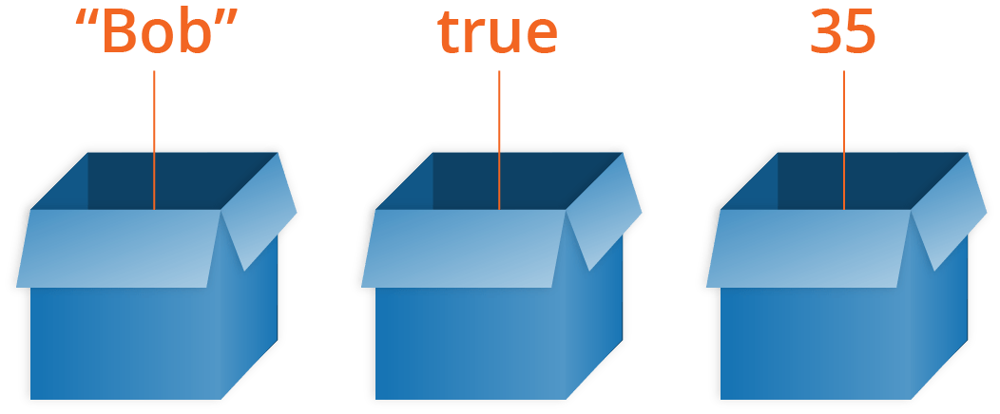

# Resourcen_Schnuppertag

## Variablen

### Wie eine Box
    - Hat eine bestimmte Grösse
    - Hat einen Bestimmten inhalt
    - Ist beschriftet

### Verschiedene Datentypen:
    - int
    - double
    - float
    - char

## Einfache Programme

### Hello World Programm:

void main () {                  //main Funktion
    printf("Hello, world");     //Textausgabe
}

### Mit Variablen Output geben
void main () {          
    int a = 1;          //Variable a deklarieren/Initialisieren
    int b = 2 * a;      //Variable b deklarieren und basierend auf a initialisieren
    printf("%d", &b);
}

### Input nehmen

void main () {
    int a = 0;
    scanf("%d", &a);       //Input nehmen
    printf("%d", a);       //Input als output ausgeben
}

### Kontrollstrukturen

void main () {
    int a = 0;

    scanf("%d", &a);
    if (a == 0) {               //if schaut, ob eine Kondition erfüllt ist
        printf("a is zero");    //Wenn der Input 0 ist, dann wird dieser Taxt ausgegeben
    }
}

